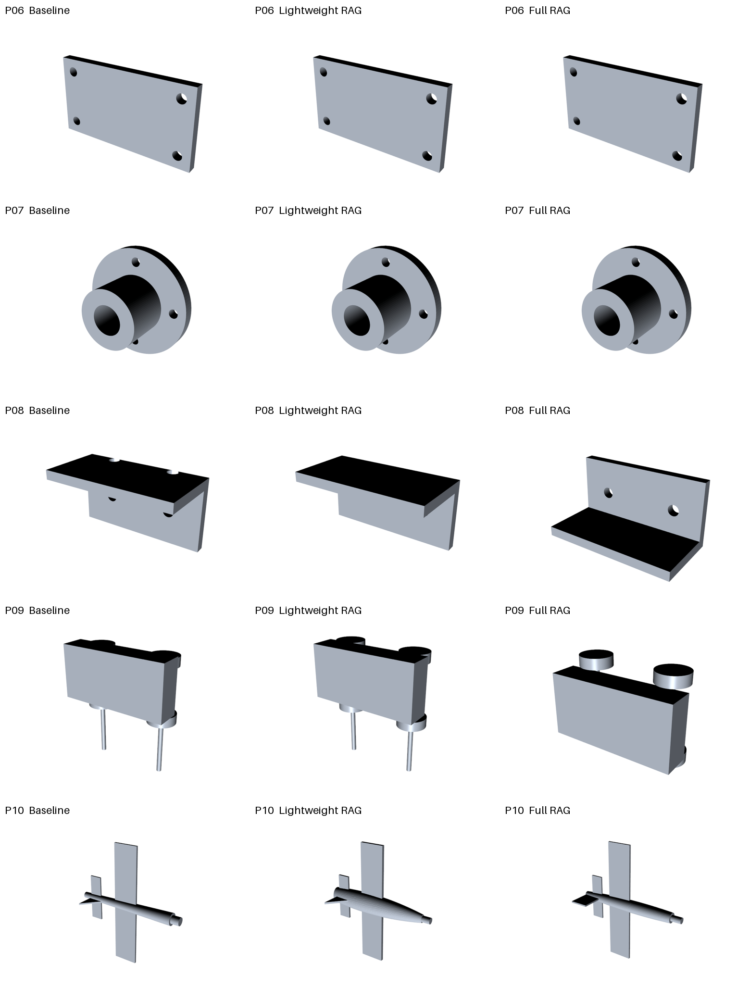

# Text2CAD with CadQuery and RAG

A research-oriented prototype that converts natural-language descriptions into
executable CadQuery programs, validates the generated geometry locally, and
exports CAD models as STEP and STL files.

```text
Natural-language prompt
        -> OpenAI-compatible LLM
        -> CadQuery Python program
        -> local execution and repair loop
        -> STEP / STL / rendered preview
```

The project includes a desktop GUI, an execution-feedback agent, SSE streaming,
two CadQuery retrieval-augmented generation (RAG) modes, and a reproducible
three-way experiment comparing generation without retrieval, lightweight RAG,
and full-documentation RAG.

## Features

- OpenAI-compatible `/chat/completions` API integration
- SSE streaming with retry handling for interrupted or timed-out responses
- Automatic repair from execution tracebacks and measured hard-constraint failures
- STEP and STL export with support for `Workplane`, `Shape`, and `Assembly`
- Off-screen VTK rendering for PNG previews
- Tkinter GUI with optional CQ-editor launch and automatic rendering
- Baseline, lightweight RAG, and full RAG generation modes
- Searchable CadQuery Workplane, Sketch, Assembly, Examples, and API references
- Reproducible experiment scripts, metrics, reports, and visual comparisons
- Exact STEP checks for solid count and cylindrical-hole geometry

## Requirements

- Python 3.10 or later
- CadQuery
- Pillow
- VTK
- Tkinter (normally included with Python)
- CQ-editor (optional)

Use a Python environment in which CadQuery can be imported:

```bash
python -c "import cadquery; print(cadquery.__version__)"
```

Install the main Python dependencies if they are not already available:

```bash
python -m pip install cadquery Pillow vtk
```

## Configuration

Create a local environment file from the template:

```bash
cp .env.example .env
```

Configure an OpenAI-compatible provider in `.env`:

```dotenv
OPENAI_API_KEY=your-api-key
OPENAI_BASE_URL=https://api.example.com/v1
OPENAI_MODEL=your-model-name

# Optional estimated-cost calculation, using the provider's current prices.
LLM_INPUT_COST_PER_1M_TOKENS=
LLM_OUTPUT_COST_PER_1M_TOKENS=
LLM_COST_CURRENCY=CNY

# Qwen3.7 enables thinking by default; set false for lower latency and cost.
LLM_ENABLE_THINKING=false

# Optional: a specific interpreter containing CadQuery.
CADQUERY_PYTHON=/path/to/your/cadquery/python
```

The program appends `/chat/completions` to `OPENAI_BASE_URL`. Do not include that
suffix in the environment variable.

`.env` is ignored by Git. Never commit API keys or access tokens.

## Quick Start

Run the complete export path without making an API request:

```bash
python -m src.text2cad.main \
  "a rectangular plate with a circular hole in the center" \
  --mock
```

Run a real model request:

```bash
python -m src.text2cad.main \
  "a 90 mm by 50 mm mounting plate with four 6 mm corner holes"
```

Generated artifacts are written to a timestamped directory under `outputs/`:

```text
generated_model.py   generated CadQuery program
model.step           STEP model
model.stl            STL mesh
run.json             execution metadata and captured errors
agent_run.json       complete agent, API, token, cost, and timing telemetry
retrieval.json       retrieved references when RAG is enabled
```

## Run Telemetry

`agent_run.json` records the requested seed, whether it was actually sent to the
provider, every generation and repair call, API transport retries, provider
request IDs, token usage, estimated cost, CadQuery execution times, and total
end-to-end latency. Missing provider usage or pricing is represented as `null`,
never as a fabricated zero.

Record an experiment seed with:

```bash
python -m src.text2cad.main "a 30 mm cube" --seed 101
```

The seed is always recorded in telemetry. For providers that support the
OpenAI-compatible `seed` field, opt in with `--send-seed`; the benchmark runner
sends its configured Qwen seeds by default.

For Alibaba Cloud Model Studio endpoints, the client automatically sends
`stream_options.include_usage=true`. Qwen reasoning, text-output, cached-input,
and total token counts are retained when the provider returns them.

## Agent Repair Loop

By default, the agent has one total budget of two code revisions. Execution and
export errors send traceback feedback; registered hard-constraint failures send
measured expected/actual/tolerance feedback. Both consume the same budget.

```bash
python -m src.text2cad.main \
  "an L-shaped bracket with four bolt holes" \
  --max-repairs 3
```

API transport retries are handled separately from code-repair attempts. A
partially received stream is discarded before the request is retried, preventing
incomplete code from being executed.

Each attempt writes its own evaluation and repair feedback. `agent_run.json`
reports `ExecutionPass@B`, `ConstraintPass@B`, and `EndToEndPass@B`, together
with separate execution- and constraint-repair counts. A GUI run uses the same
total-budget policy; constraint repairs activate whenever machine-readable hard
constraints are registered by the calling workflow.

## RAG Modes

The command-line interface and GUI provide three generation settings:

| Mode | CLI option | Reference source |
|---|---|---|
| Baseline | `--rag-mode off` | No retrieved context |
| Lightweight RAG | `--rag-mode lightweight` | Eight curated CadQuery modelling patterns |
| Full RAG | `--rag-mode full` | Curated patterns, official guides, examples, and API index |

Example:

```bash
python -m src.text2cad.main \
  "an open-top box with 3 mm walls" \
  --rag-mode full \
  --rag-top-k 3
```

The knowledge base is stored in [`knowledge/`](knowledge/). Rebuild the API and
official-guide indexes after upgrading CadQuery:

```bash
python scripts/build_cadquery_reference.py
```

## Desktop GUI

Start the GUI with:

```bash
python -m src.text2cad.gui
```

The interface supports prompt entry, repair-count selection, knowledge-mode
selection, generation logs, source-code inspection, and rendered STL previews.
When CQ-editor is available, the generated model can also be opened and rendered
automatically in its interactive 3D viewport.

## RAG Experiment

The included experiment evaluates 10 prompts at increasing difficulty under all
three generation settings. Traceback repair is disabled during evaluation so
that compilation measures the first generated program.

| Quantitative metric | Baseline | Lightweight RAG | Full RAG |
|---|---:|---:|---:|
| First-generation execution success | 10/10 | 10/10 | 10/10 |
| STEP and STL export success | 10/10 | 10/10 | 10/10 |
| Valid, non-degenerate STL geometry | 10/10 | 10/10 | 10/10 |
| Task success v1 | 9/10 | 10/10 | 10/10 |
| V2 constraint groups passed/evaluated | 25/27 | 24/26 | 25/26 |
| V2 constraint evaluation coverage | 27/27 | 26/27 | 26/27 |
| Task success v2 | 9/10 | 7/10 | 8/10 |



Full reports and result tables are available under
[`experiments/cadquery_rag/results/`](experiments/cadquery_rag/results/).
The exact metric definitions and current semantic-coverage limitations are in
[`experiments/cadquery_rag/EVALUATION.md`](experiments/cadquery_rag/EVALUATION.md).

Run the experiment and rebuild the report with:

```bash
python scripts/run_rag_experiment.py --resume
python scripts/run_rag_experiment.py --seed 101 --limit 1
python scripts/evaluate_existing_experiment.py
python scripts/analyze_rag_experiment.py
```

## 60-Case Benchmark v1

The held-out benchmark contains 60 cases across ten geometry and prompt-behavior
categories, evaluated under baseline, lightweight RAG, and full RAG with three
seeds. A unified `B=2` repair budget covers both execution-triggered and measured
hard-constraint repairs.

All 540 scheduled tasks completed. Across the 486 CAD-generation runs,
EndToEndPass improved from 73.05% at `B=0` to 91.56% at `B=2`. Baseline reached
93.83% at `B=2`, lightweight RAG reached 90.74%, and full RAG reached 90.12%.
The remaining 54 conflicting-description runs captured clarification responses
and remain available for later human or VLM scoring.

The frozen cases, protocol, final reports, aggregate tables, and figures are in
[`experiments/cadquery_benchmark_v1/`](experiments/cadquery_benchmark_v1/).

Validate, run/resume, and regenerate the final report with:

```bash
python scripts/validate_benchmark.py \
  --cases experiments/cadquery_benchmark_v1/full_cases.json
bash scripts/run_full_benchmark.sh
python scripts/generate_final_benchmark_report.py
```

## Tests

Run the test suite with:

```bash
python -m unittest discover -s tests -v
```

The tests cover quantitative evaluation, streaming response assembly, connection
retries, partial-stream recovery, RAG retrieval behavior, and CadQuery Assembly
export.

## Project Structure

```text
src/text2cad/
  main.py       command-line interface
  gui.py        desktop interface and CQ-editor integration
  agent.py      generation, execution, evaluation, and unified repair loop
  evaluation.py quantitative artifact and constraint evaluation
  step_features.py exact STEP solid and cylindrical-hole extraction
  llm.py        streaming OpenAI-compatible API client
  prompts.py    generation prompts and response cleanup
  rag.py        reference loading, retrieval, and logging
  runner.py     isolated-process execution and STEP/STL export
  renderer.py   off-screen VTK preview rendering

knowledge/      curated and generated CadQuery references
experiments/    frozen evaluator contract, benchmarks, reports, and metrics
scripts/        knowledge-index and experiment utilities
tests/          unit and export regression tests
```

## Security

This project executes Python code produced by an LLM. The generated program is
run in a separate process with a timeout, but it is not a complete security
sandbox. Use trusted model providers, inspect generated code when appropriate,
and run the project in an isolated development environment when testing unknown
prompts or models.
