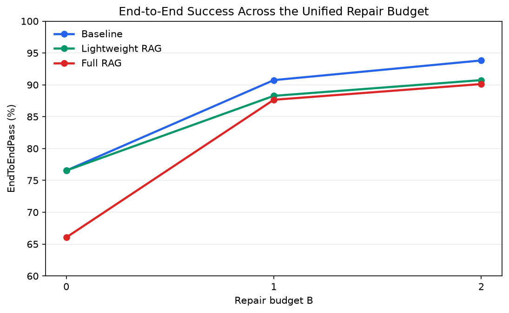
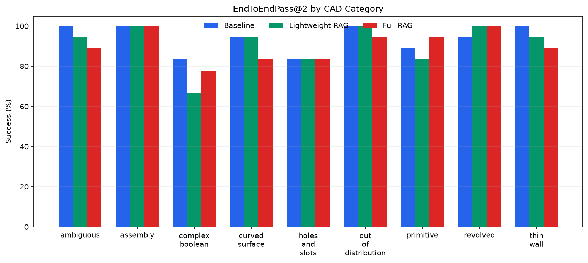
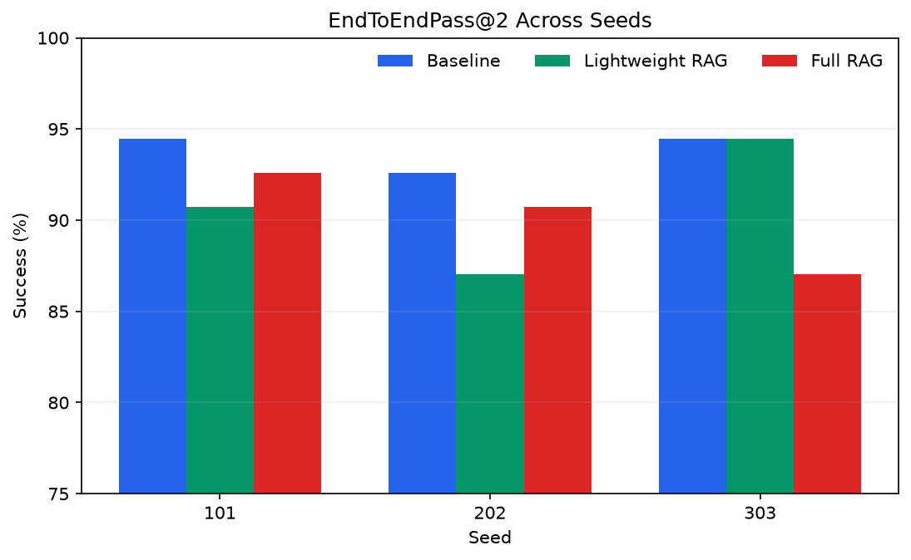
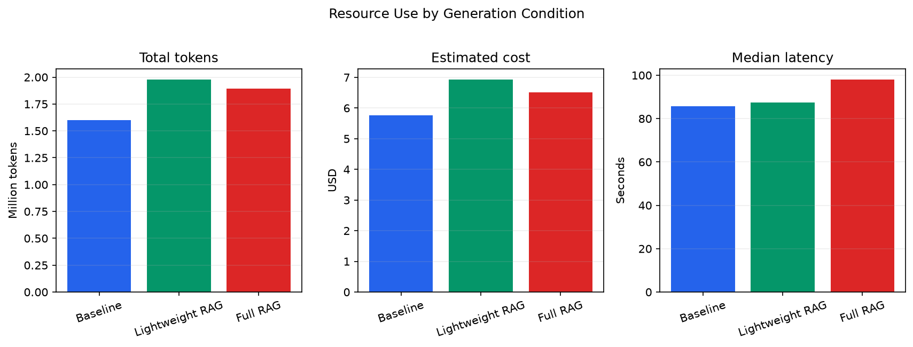

# CadQuery Benchmark v1 最终实验报告

## 摘要

本次留出测试包含 60 个案例，覆盖 10 个类别、3 种生成模式和 3 个 seed。计划中的 540 个 API 任务已全部完成，其中包括 486 个 CAD 生成任务和 54 个冲突澄清任务。

在 CAD 任务上，EndToEndPass 从 B=0 的 355/486（73.05%）提升到 B=2 的 445/486（91.56%），提高 18.52 个百分点。最终 ExecutionPass@2 为 98.97%，说明剩余失败主要来自硬约束，而不是 Python/CadQuery 执行。

Baseline 的 EndToEndPass@2 最高，为 93.83%；Lightweight RAG 为 90.74%；Full RAG 为 90.12%。在当前检索和提示配置下，加入参考资料没有提高主要自动指标。



## 实验设计

- 模型：`qwen3.7-max`，temperature=0.1。
- 测试集：B013-B072，共 60 个留出案例，每类 6 个。
- Seed：101, 202, 303。
- 模式：Baseline、轻量级 CadQuery 参考库、完整官方文档 RAG。
- 统一修复预算：B=2。执行错误修复和硬约束修复共享预算；未修改请求的网络重试不计入预算。
- 自动硬约束：包围盒尺寸/边界、STEP 实体数量、圆柱孔阵列。
- 冲突描述案例只请求澄清，不执行 CAD，也不进行代码修复。

## 指标定义

- **ExecutionPass@B**：预算 B 内代码成功执行，并导出要求的 STEP/STL。
- **ConstraintPass@B**：预算 B 内全部已注册自动硬约束均完成评价并通过。
- **EndToEndPass@B**：执行、导出、非退化有效几何和全部自动硬约束同时通过。
- **B=0** 表示首次生成；B=1/B=2 分别允许模型修改代码 1/2 次。

## 主要结果

| Metric | @0 | @1 | @2 |
|---|---:|---:|---:|
| ExecutionPass | 450/486 (92.59%) | 476/486 (97.94%) | 481/486 (98.97%) |
| ConstraintPass | 356/486 (73.25%) | 433/486 (89.09%) | 445/486 (91.56%) |
| EndToEndPass | 355/486 (73.05%) | 432/486 (88.89%) | 445/486 (91.56%) |

| Condition | CAD n | E2E@0 | E2E@1 | E2E@2 | Repairs | Tokens | Cost | Median latency |
|---|---:|---:|---:|---:|---:|---:|---:|---:|
| Baseline | 162 | 76.54% | 90.74% | 93.83% | 53 | 1,598,172 | USD 5.7544 | 85.75s |
| Lightweight RAG | 162 | 76.54% | 88.27% | 90.74% | 57 | 1,978,328 | USD 6.9308 | 87.47s |
| Full RAG | 162 | 66.05% | 87.65% | 90.12% | 75 | 1,892,655 | USD 6.5085 | 98.04s |

B=2 EndToEndPass 的运行级 Wilson 95% 区间为 88.76% 至 93.72%。由于同一 prompt 的多次运行并非完全独立，该区间只作为描述性结果。

## 成对模式比较

| Comparison | B | Baseline | Comparison | Difference | Baseline only | Comparison only | Exact p |
|---|---:|---:|---:|---:|---:|---:|---:|
| Lightweight RAG vs Baseline | 0 | 124/162 | 124/162 | +0.00 pp | 21 | 21 | 1.0000 |
| Lightweight RAG vs Baseline | 1 | 147/162 | 143/162 | -2.47 pp | 11 | 7 | 0.4807 |
| Lightweight RAG vs Baseline | 2 | 152/162 | 147/162 | -3.09 pp | 7 | 2 | 0.1797 |
| Full RAG vs Baseline | 0 | 124/162 | 107/162 | -10.49 pp | 32 | 15 | 0.0186 |
| Full RAG vs Baseline | 1 | 147/162 | 142/162 | -3.09 pp | 12 | 7 | 0.3593 |
| Full RAG vs Baseline | 2 | 152/162 | 146/162 | -3.70 pp | 11 | 5 | 0.2101 |

McNemar 精确检验按相同 prompt 和 seed 配对，只反映本测试集中的运行级差异，不能单独证明对其他任务的泛化。

## 修复闭环效果

首次生成共有 131 个端到端失败。B=1 时累计修复 77 个，B=2 时累计修复 90 个；第二次修复额外恢复 13 个。B=2 条件失败恢复率为 68.70%。

系统共使用 185 次模型修改，其中执行错误触发 60 次，硬约束错误触发 125 次。所有 CAD 任务平均修复 0.381 次；只统计发生过修复的任务时，平均为 1.412 次。

## 类别与 Seed 分析



| Category | Baseline E2E@2 | Lightweight RAG | Full RAG |
|---|---:|---:|---:|
| ambiguous | 18/18 (100.00%) | 17/18 (94.44%) | 16/18 (88.89%) |
| assembly | 18/18 (100.00%) | 18/18 (100.00%) | 18/18 (100.00%) |
| complex_boolean | 15/18 (83.33%) | 12/18 (66.67%) | 14/18 (77.78%) |
| conflicting | clarification only | clarification only | clarification only |
| curved_surface | 17/18 (94.44%) | 17/18 (94.44%) | 15/18 (83.33%) |
| holes_and_slots | 15/18 (83.33%) | 15/18 (83.33%) | 15/18 (83.33%) |
| out_of_distribution | 18/18 (100.00%) | 18/18 (100.00%) | 17/18 (94.44%) |
| primitive | 16/18 (88.89%) | 15/18 (83.33%) | 17/18 (94.44%) |
| revolved | 17/18 (94.44%) | 18/18 (100.00%) | 18/18 (100.00%) |
| thin_wall | 18/18 (100.00%) | 17/18 (94.44%) | 16/18 (88.89%) |



| Seed | Baseline E2E@2 | Lightweight RAG | Full RAG |
|---:|---:|---:|---:|
| 101 | 51/54 (94.44%) | 49/54 (90.74%) | 50/54 (92.59%) |
| 202 | 50/54 (92.59%) | 47/54 (87.04%) | 49/54 (90.74%) |
| 303 | 51/54 (94.44%) | 51/54 (94.44%) | 47/54 (87.04%) |

## 剩余自动失败

B=2 后仍有 41/486 个 CAD 任务失败。最终失败阶段为：hard_constraint=36, execution_or_export=5。

| Failed hard-constraint type at B=2 | Failed groups |
|---|---:|
| cylindrical_hole_pattern | 21 |
| solid_count | 11 |
| bbox_dimensions | 11 |
| bbox_bounds | 7 |

完整的运行级失败列表保存在 `final_failure_runs.csv`。

## 资源消耗与 API 可靠性



| Condition | Total tokens | Cost | Mean latency | Median latency | P95 latency | Transport retries |
|---|---:|---:|---:|---:|---:|---:|
| Baseline | 1,598,172 | USD 5.7544 | 161.07s | 85.75s | 565.88s | 37 |
| Lightweight RAG | 1,978,328 | USD 6.9308 | 186.18s | 87.47s | 572.28s | 30 |
| Full RAG | 1,892,655 | USD 6.5085 | 192.97s | 98.04s | 633.83s | 53 |

| LLM call type | Calls | Tokens | Cost | Total LLM latency |
|---|---:|---:|---:|---:|
| clarification | 54 | 62,497 | USD 0.1672 | 1381.30s |
| generation | 486 | 3,828,582 | USD 13.6964 | 68840.35s |
| repair_constraint | 125 | 1,163,369 | USD 3.9577 | 19058.45s |
| repair_execution | 60 | 414,707 | USD 1.3724 | 7266.45s |

记录到的总用量为 5,469,155 tokens，估算费用 USD 19.1937。共有 120 次网络重试，涉及 81 个任务；网络重试不消耗模型修复预算。

## 澄清任务与待补评价

54/54 个冲突描述任务均生成了澄清回复，但回复是否正确仍未评分。`manual_scoring.csv` 已保留 594 行人工或 VLM 评价位置；这些待评结果没有被计入任何自动成功率。

## 局限性

- 除非已经注册为 v2 硬约束，当前自动评价不能测量可识别性、语义相似度、槽尺寸、薄壁厚度或整体视觉质量。
- 捕获到澄清回复不等于回复正确，冲突处理能力仍需人工或 VLM 评价。
- 实验只使用一个模型、一个 API 提供方、三个 seed 和一套检索配置。
- Full RAG 每次检索 top-k 片段，并不是把全部官方文档放入每个请求。
- 运行级置信区间会低估 prompt 内部相关性；成对检验有所缓解，但仍需新的独立案例集复现。
- API 未返回 usage 的失败请求不会进入 token 和费用总计，包括部分后续通过 resume 补齐的任务级失败。

## 结论

本实验最明确的正向结果是硬约束反馈修复闭环：EndToEndPass 从 73.05% 提升到 91.56%。大多数代码修改由几何硬约束失败触发，说明“执行 + 几何测量反馈”相比只依赖 traceback 具有实际价值。另一方面，两种 RAG 模式均未在主要自动指标上超过 Baseline。下一阶段应在扩展硬约束注册表的同时，引入盲评人工评价或经过验证的 VLM 评分体系，补充语义和视觉质量证据。

## 复现方式

本报告直接由 `records.json` 生成：

```bash
python scripts/generate_final_benchmark_report.py
```
